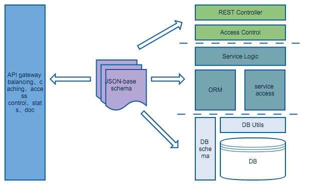

# 微服务架构应用分析
## 什么是微服务架构？
将全系统的业务按照功能拆解为规模合适的、功能内聚的独立服务，服务通过基于网络的RPC接口进行服务间的交互或者对外提供服务。

## 微服务的优缺点
### 优点
1. 简单，功能内聚，复用性高
2. 开发迭代快
3. 独立部署，扩展灵活

### 不足
1. 服务的规模需要控制在一定范围
2. 服务间交互相对于单体架构更复杂
3. 不利于事务操作，需要使用最终一致性方法（eventual consistency based approach）
4. 测试更复杂
5. 涉及多服务变更时，顺序很重要
6. 部署服务及所依赖的服务依赖比单体架构更多的自动化

单体应用架构：


微服务架构：


## 微服务总结
1. 并不是什么新概念，是SOA的变种；服务化、平台化其实已经深入人心，并证明可行；
2. 其实就是服务级的模块化，有模块化的各种优点，不足之处没有硬伤，通过一些基础设施的搭建以及自动化工作都能解决;
3. 做好API gateway, 服务间通讯是关键；
4. 实践是关键：服务易于搭建、开发、部署，服务API易于发现、调用、管理

## 结合团队现状
### 现状
1. 服务化或者在服务化的路上，但是水平参差不齐，接口风格混乱，代码和框架没有积累（造成低水平重复劳动）
2. 服务缺乏统一的管理，包括权限控制、统计、调试、文档等

### 解决方案
#### 业务系统的三大组成部分
1. 业务模型实体及其关系
2. 数据接口和视图
3. 数据存储

#### 假设
业务的本质就是数据的传输和存储。
80%的业务这样完成：
1. 通过schema清晰的定义业务模型和关系
2. 根据schema在框架层面完成完成从REST接口到数据入库的系列流程，在流程预留扩展点满足特殊逻辑需求；
3. 为REST接口提供丰富的配置项满足不同接口方的需求，比如哪些字段是可以通过create和update接口变更的，哪些字段是可以通过list接口列举的

20%的业务这样完成：
1. 针对虚拟对象和复杂操作
2. 提供便捷的路由挂载、ORM/DB utils、services access utils来自由的编写逻辑


### 工作
#### 微服务框架
1. REST controller
controller的定义和编写本身比较简单，如何支持复杂的查询语义是个难点，目前在物料库中实现了一个版本：
`GET /api/${resource}/query?${querystring}`
参数：
`_skip=${n}`: 跳过n跳记录，默认为0，可选
`_limit=${n}`: 限制返回条数，默认为20，[0,100)之间，可选
`_asc=${attr}`: 按照字段正序返回，可选
`_desc=${attr}`: 按照字段逆序返回，可选
`_wd=${keywords}`: 关键字搜索
`${attr}=${value}`: 按照字段与值相等为条件过滤列表，可选，可添加多条，一个字段不允许出现多次
`${attr}=in:${value1},${value2}`：in条件
`_pull=${attr1},${$attr2}`：通过ID拉去并填充字段
但是并不系统，并且这种方式受限于http querystring的表达能力。
替代方案graphQL，一种类JSON的表达方式:
```
{
  user(id: 1) {
    name
    age
    friends {
      name
    }
  }
}
```
[graphGL 规范](https://facebook.github.io/graphql/)

2. ORM
参考laravel [eloquent ORM](http://www.golaravel.com/laravel/docs/5.0/eloquent/)
lumen下直接使用，ap下可以做适配。

3. DB utils
目前在物料库中根据[Meteor](http://docs.meteor.com/#/basic/Mongo-Collection) collection API 实现了一个, 对翻页、排序、映射、拉取等做比较好的支持。

4. Service Access Utils
需要根据统一的接口规范来实现一个服务的接入类，目标是让服务间的交互像操作数据库一样简单。

5. 业务的JSON-schema定义

6. API gateway
gateway做好服务的发现和管理。内部有团队做过[实践]。